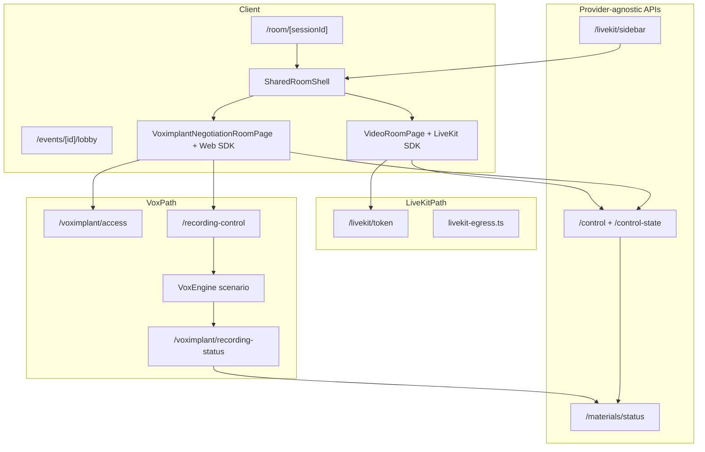
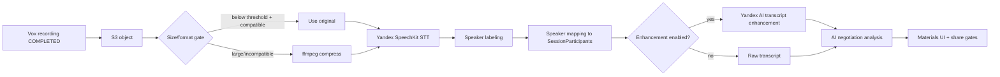

# Current Solution Architecture Audit

**Date:** 2026-07-03  
**Scope:** Read-only audit of NegotAItions web app after Yandex Cloud / Voximplant POC migration  
**Workspace:** `negotiations-web`  
**POC domain:** `https://app.negotaitions.ru`

---

## 1. Executive summary

NegotAItions is a Next.js 16 negotiation-training application with a **provider-split video stack**:

| Layer | Status |
|---|---|
| Domain (cases, events, sessions, roles, timers, materials) | Shared, provider-agnostic, largely unchanged from LiveKit era |
| Video transport | Switched via `VIDEO_PROVIDER` (`livekit` \| `voximplant`) |
| Recording | LiveKit egress **or** Voximplant scenario + browser relay + HMAC webhook |
| Transcription | OpenAI **or** Yandex SpeechKit (`TRANSCRIPTION_PROVIDER`) |
| AI analysis | OpenAI **or** Yandex AI (`AI_ANALYSIS_PROVIDER`) |

The **technical Vox/recording/Yandex pipeline is implemented and documented as working**. Session UX parity with the original LiveKit room has been **partially restored** (shared shell, timer panel, role-zoned Vox layout, Vox event lobby), but **heuristic role mapping, remote presence/audio semantics, lobby deduplication, and multi-instance lease behavior** remain risk areas.

---

## 2. Application architecture map

### 2.1 Next.js routes (pages)

#### Public / legal

| Route | Purpose |
|---|---|
| `/` | Landing |
| `/privacy`, `/terms`, `/cookie-policy` | Legal |
| `/data-processing-consent`, `/ai-processing-notice` | Consent notices |

#### Auth (`app/(auth)/`)

| Route | Purpose |
|---|---|
| `/login`, `/register` | Account entry |
| `/pending-approval`, `/account/rejected`, `/account/blocked` | Account status gates |

#### Authenticated app shell (`app/(app)/`)

| Route | Purpose |
|---|---|
| `/dashboard` | Home hub |
| `/cases`, `/cases/new`, `/cases/[id]`, `/cases/[id]/edit` | Case library CRUD |
| `/sessions`, `/sessions/new`, `/sessions/[id]`, `/sessions/[id]/materials` | Standalone session management + materials |
| `/events`, `/events/new`, `/events/[id]/edit` | Event management |
| `/account/settings` | User preferences (locale, etc.) |
| `/admin`, `/admin/users`, `/admin/log`, `/admin/counters`, `/admin/voximplant-recording` | Admin diagnostics and ops |

#### Session / event runtime (outside `(app)` layout)

| Route | Purpose |
|---|---|
| `/room/[sessionId]` | Live negotiation room (provider switch) |
| `/join/[joinToken]` | Legacy join → bind account → redirect |
| `/rejoin` | Rejoin recovery UX |
| `/events/[id]/join` | Event join (login required for hardened flows) |
| `/events/[id]/lobby` | Event lobby (LiveKit or Voximplant media) |
| `/events/join/[publicJoinCode]` | Public event join code |
| `/voximplant-test` | Dev-only Vox smoke page |

**Room provider switch** (`app/room/[sessionId]/page.tsx`):

- `VIDEO_PROVIDER=voximplant` → `VoximplantNegotiationRoomPage`
- otherwise → `VideoRoomPage` (LiveKit)

Account mode is preferred: unauthenticated users redirect to `/login?returnUrl=...`; authenticated users resolve `SessionParticipant` server-side via `ensureAccountRoomParticipant`.

---

### 2.2 Server actions (`app/actions/`)

| File | Responsibility |
|---|---|
| `auth.ts` | Register, login, logout; custom cookie session |
| `account.ts` | Account settings |
| `cases.ts` | Case CRUD |
| `sessions.ts` | Standalone session creation |
| `events.ts` | Event CRUD / host operations |
| `admin-users.ts` | Admin user approval/block |
| `voximplant-recording-webhook.ts` | Admin webhook override persistence (AppSetting) |

No global middleware; auth enforced per page/API via `getOptionalCurrentUser`, `requireActiveUser`, `apiRequireActiveUser`.

---

### 2.3 API routes (58 route handlers)

#### Session room orchestration

| Route | Role |
|---|---|
| `POST /api/sessions/[sessionId]/control` | Facilitator state machine (preparation/negotiation) |
| `GET /api/sessions/[sessionId]/control-state` | Timer + permissions polling (1s client interval) |
| `POST /api/sessions/[sessionId]/heartbeat` | Room presence |
| `GET /api/sessions/[sessionId]/presence`, `/presence/stream` | Presence APIs |
| `GET /api/livekit/sidebar` | **Shared** sidebar/roster serializer (name is LiveKit-legacy) |
| `POST /api/livekit/token` | LiveKit room token |
| `POST /api/sessions/[sessionId]/voximplant/access` | Voximplant one-time-key handshake |
| `POST /api/sessions/[sessionId]/recording-control` | Recording start/stop/refresh (provider dispatch) |
| `GET/POST /api/sessions/[sessionId]/recording` | Recording metadata |
| `POST /api/sessions/[sessionId]/voximplant/recording-status` | VoxEngine HMAC webhook ingest |
| `GET /api/debug/recording/[sessionId]` | Recording debug panel data |

#### Materials / AI pipeline

| Route | Role |
|---|---|
| `GET /api/sessions/[sessionId]/materials/status` | Polling hub for recording → transcript → AI stages |
| `POST /api/sessions/[sessionId]/materials/transcribe` | Start transcription job |
| `POST .../materials/transcribe/stop` | Cancel transcription |
| `POST .../materials/retranscribe`, `/enhance-transcript` | Re-run stages |
| `POST /api/sessions/[sessionId]/transcribe-recording` | Legacy/alternate transcribe entry |
| `POST /api/sessions/[sessionId]/analyze` | AI analysis trigger |
| `POST /api/sessions/[sessionId]/ai-analysis/share`, `/unshare` | Observer/participant visibility |
| `GET/POST /api/sessions/[sessionId]/speaker-mapping` | Diarization → role mapping |
| `POST /api/sessions/[sessionId]/manual-speaker-attribution` | Manual speaker fixes |

#### Event / lobby

| Route | Role |
|---|---|
| `GET /api/events/[id]/state` | Lobby state + assignment cards |
| `PATCH/POST /api/events/[id]/host` | Assignment draft + session creation |
| `PATCH /api/events/[id]/participant` | Preference (PLAY/OBSERVE/FACILITATE) |
| `POST /api/events/[id]/livekit-token` | LiveKit lobby token |
| `POST /api/events/[id]/voximplant-access` | Voximplant lobby credentials |
| `POST /api/events/[id]/complete` | Event completion |
| `GET /api/events/[id]/heartbeat`, `/presence/*` | Lobby presence |

#### Admin diagnostics

| Route | Role |
|---|---|
| `GET /api/admin/health` | Config + dependency health |
| `GET /api/admin/check-voximplant` | Vox connectivity probe |
| `GET /api/admin/check-livekit`, `/check-storage`, `/check-openai`, `/check-ffmpeg` | Service probes |
| `GET /api/admin/service-warnings` | External service event summary |

#### Test / dev only

| Route | Role |
|---|---|
| `/api/voximplant-test/*` | Isolated Vox recording smoke |
| `/api/test/create-session-from-event` | E2E helper |
| `/api/test/mock-external-service` | Test doubles |

---

### 2.4 Prisma domain model (summary)

Core entities in `prisma/schema.prisma`:

| Model | Purpose |
|---|---|
| `User` | Account; `globalRole` (USER/ADMIN), `status` (PENDING_APPROVAL/ACTIVE/...) |
| `UserSession` | Cookie session tokens (hashed) |
| `NegotiationCase`, `CaseRole` | Reusable scenario templates |
| `Session`, `SessionRole`, `SessionParticipant` | Training run + role snapshot + actors |
| `TrainingEvent`, `EventParticipant` | Club event + lobby identities |
| `EventInvite`, `SessionInvite` | Invite surfaces |
| `VideoProviderIdentity` | Voximplant SDK username per user |
| `Recording`, `Transcript`, `TranscriptSegment`, `AiAnalysis` | Post-session pipeline |
| `SessionPauseInterval`, `SessionParticipantAudioActivity` | Timer/presence telemetry |
| `AppSetting` | Runtime admin overrides (e.g. webhook base URL) |
| `AdminActionLog`, `ExternalServiceEvent`, `UsageCounter` | Ops/telemetry |

**Negotiation state machine** (`NegotiationState`):  
`PREPARATION` → `PREPARATION_RUNNING` → `PREPARATION_PAUSED` → `READY_TO_START` → `RUNNING` ↔ `PAUSED` → `FINISHED`

Timer fields on `Session`: `preparationDurationSeconds`, `durationSeconds`, `*TimerStartedAt`, `*PausedAt`, `*TotalPausedSeconds`.

---

### 2.5 Auth / session model

- **Not NextAuth.** Custom implementation in `lib/auth/session.ts`.
- Cookie: `auth_session` (httpOnly, secure in production, 30-day TTL).
- Session rows in `UserSession` with hashed token.
- Guards: `requireActiveUser`, `requireAdminUser`, `apiRequireActiveUser`.
- Admin: `ADMIN_EMAILS` env list + `User.globalRole === "ADMIN"`.
- Account approval workflow: `PENDING_APPROVAL` → `ACTIVE`.

---

### 2.6 i18n

| Component | Location |
|---|---|
| Dictionaries | `lib/i18n/dictionaries/en.ts`, `ru.ts` |
| Client hook | `lib/i18n/useI18n.ts` |
| Server locale | `lib/i18n/server.ts` (cookie `locale`, Accept-Language fallback) |
| Default locale | `ru` |
| User preference | `User.preferredLocale` + cookie |

Room, lobby, facilitator controls, and Vox media labels are dictionary-driven (Stage 2 i18n pass).

---

### 2.7 Admin diagnostics

| Surface | Entry |
|---|---|
| Admin home | `/admin` → `AdminDiagnosticsView` |
| Health API | `/api/admin/health` |
| Env display | `lib/services/admin-env-display.ts` (masked secrets) |
| Vox webhook override | `/admin/voximplant-recording` + `AppSetting` |
| Recording debug panel | `?debugRecording=1` or `RECORDING_DEBUG_PANEL=true` |

---

## 3. Provider architecture

### Shared orchestration layer

`components/shared-room-shell.tsx` owns:

- Sidebar (briefings, notes, role management in PREPARATION)
- Facilitator controls (`FacilitatorRoomControls`)
- Recording indicator
- Timer consumption via provider `mediaArea` slot
- Debrief overlay + session closed UX
- Presence heartbeat

Provider injects: `mediaArea`, `controlBar`, `leaveButton`, optional LiveKit-only slots (`MicEnforcement`, `SpeakingActivityTracker`, `RoomAudioRenderer`).

---

## 4. Voximplant flow map

| Stage | Implementation |
|---|---|
| Identity provisioning | `lib/voximplant/identity.ts` → `VideoProviderIdentity` + Management API |
| Conference naming | `lib/voximplant/conference-name.ts` → `neg-conf-{sessionId}` |
| Room join | `lib/voximplant/use-voximplant-room.ts` (one-time key, SDK connect) |
| Access API | `app/api/sessions/[sessionId]/voximplant/access/route.ts` |
| Lobby access | `app/api/events/[id]/voximplant-access/route.ts` |
| Layout | `components/voximplant-video-layout.tsx` + `lib/voximplant/room-layout-model.ts` |
| Mic/video | `components/voximplant-media-controls.tsx` |
| Duplicate endpoint handling | Last-write-wins in `remoteByVoxUsername` map |
| Connection lease | `lib/session-room-connection-lease.ts` (in-memory, per process) |
| Recording dispatch | `lib/voximplant/recording-dispatch.ts` → scenario message JSON |
| Browser relay | `VoximplantNegotiationRoomPage` → `sendConferenceMessage` |
| Webhook | HMAC `X-Voximplant-Signature`, objectKey → S3 fileKey |
| Scenario sync | `scripts/voximplant-*.mjs`, `.voxengine-ci/` |

---

## 5. Yandex / AI pipeline map

| Step | Key files |
|---|---|
| Recording file | `Recording.fileKey`, webhook handler |
| Audio prep | `lib/audio/compress.ts`, `lib/audio/config.ts`, `lib/services/transcription-runner.ts` |
| Transcription | `lib/services/yandex-speechkit-transcription.ts` |
| Speaker mapping | `lib/transcription/speaker-labels.ts`, `/speaker-mapping` API |
| Enhancement | `lib/services/yandex-transcript-enhancement.ts` |
| Analysis | `lib/ai/negotiation-analysis.ts` |
| Status polling | `app/api/sessions/[sessionId]/materials/status/route.ts` |
| Auto-transcribe | `AUTO_TRANSCRIBE_AFTER_RECORDING` env (default false) |

---

## 6. Domain flows (high level)

### Standalone session

1. Facilitator creates session (`app/actions/sessions.ts` or `/sessions/new`).
2. Participants added with roles (`SessionParticipant`, `SessionRole`).
3. Users open `/room/[sessionId]` (account mode).
4. Facilitator drives preparation → negotiation via control API.
5. Recording starts on negotiation START (LiveKit egress auto; Vox relay on START callback).
6. FINISH → debrief → materials polling → transcribe → analyze.

### Event-based session

1. Create event → `LOBBY_OPEN`.
2. Join `/events/[id]/join` → lobby `/events/[id]/lobby`.
3. Host selects case + assignment draft → `POST /api/events/[id]/host`.
4. `createSessionFromEvent` (`lib/create-event-session.ts`) creates session + links `EventParticipant.assignedSessionId`.
5. Assigned cards link to `/room/[sessionId]`.
6. After session close, return to lobby for next round or complete event.

---

## 7. Suspected gaps (architecture-level)

| Area | Gap | Severity |
|---|---|---|
| Dual provider stack | LiveKit + Vox code paths both shipped; misconfigured env could silently use wrong provider | Medium |
| API naming | `/api/livekit/sidebar` is shared but name implies LiveKit-only | Low |
| Auth docs vs code | Runbooks mention `NEXTAUTH_*`; app uses custom `auth_session` + `APP_URL` | Medium (ops confusion) |
| Connection leases | In-memory `globalThis` maps; breaks with multi-process/multi-instance | High (scale-out) |
| Event participant dedupe | No DB unique on `(eventId, userId)`; duplicate lobby cards possible | Medium |
| Role slot heuristics | Vox layout maps roles by keyword (`buyer`, `участник а`, etc.) not `sortOrder` | Medium |
| Remote audio UX | Vox: no remote speaking indicators; remote mic state is policy-derived | Medium |
| Guest lobby Vox | Account-only for Vox event lobby (`VOXIMPLANT_EVENT_LOBBY_GUEST_DEFERRED`) | Low (by design?) |
| `livekitRoomName` on Session | Still populated for LiveKit; Vox uses conference name helper instead | Low |

---

## 8. High-risk files / routes / functions

| Risk | Location | Why |
|---|---|---|
| Recording webhook integrity | `app/api/sessions/[sessionId]/voximplant/recording-status/route.ts` | Single source of `Recording.fileKey`; HMAC misconfig blocks pipeline |
| Browser recording relay | `components/voximplant-negotiation-room-page.tsx` | START/FINISH depends on client sending scenario message |
| Control + auto-transitions | `lib/negotiation-control.ts`, `app/api/sessions/[sessionId]/control/route.ts` | Timer authority; wrong change breaks session UX |
| Role assignment | `lib/create-event-session.ts` | Event → session role snapshot |
| Vox identity provisioning | `lib/voximplant/identity.ts`, `lib/voximplant/management-api.ts` | Join failure if Management API/key path wrong |
| Transcription runner | `lib/services/transcription-runner.ts` | Long-running; S3/ffmpeg/SpeechKit failures |
| Webhook URL resolution | `lib/voximplant/recording-webhook-url.ts` | Env + AppSetting override; wrong URL = no COMPLETED |
| Layout role mapping | `lib/voximplant/room-layout-model.ts` | Wrong tiles → training confusion |

---

## 9. Manual testing priorities

See `docs/testing/yandex-poc-smoke-regression-plan.md`.

Minimum POC smoke:

1. Admin health green on `app.negotaitions.ru/admin`.
2. Full event → lobby (Vox) → create session → room → START → FINISH → webhook → materials.
3. Timer visible and synced across two browsers (facilitator + participant).
4. Role tiles in correct zones for standard 2-role case.
5. Observer cannot control; participant mic locked during RUNNING for non-participants.
6. Transcription + AI complete with Yandex providers.

---

## 10. E2E coverage (later)

Existing Vox-focused specs:

- `tests/e2e/voximplant-room-parity.spec.ts`
- `tests/e2e/voximplant-event-lobby.spec.ts`
- `tests/e2e/voximplant-layout-camera-model.spec.ts`
- `tests/e2e/voximplant-recording-debug.spec.ts`

**Missing:** single end-to-end spec for event → lobby → room → recording webhook → SpeechKit → analysis on production-like env.

Domain specs (`event-flow`, `session-lifecycle`, `session-materials-processing`) remain largely provider-agnostic but may still assume LiveKit in places.

---

## 11. Recommendations (documentation only)

1. Treat `SharedRoomShell` + domain APIs as the stability boundary; isolate provider changes behind adapters.
2. Align deployment docs with actual auth (`auth_session`, `APP_URL`) and remove stale NextAuth references from operator runbooks.
3. Before scaling POC beyond one Node process, externalize connection leases or accept single-instance constraint explicitly.
4. Add read-time dedupe for `EventParticipant` in `buildEventState` before UI changes.
5. Replace keyword-based role slot mapping with explicit `SessionRole.sortOrder` or case role metadata.
6. Capture one production recording sample + `npm run inspect:audio` baseline for codec/bitrate evidence.
7. Add one Playwright spec gated on `VIDEO_PROVIDER=voximplant` for full materials chain.

---

## 12. Related internal docs

| Document | Topic |
|---|---|
| `docs/voximplant/domain-and-session-architecture-map.md` | Stage 5.5A domain map |
| `docs/voximplant/session-flow-parity-audit.md` | Pre-correction parity matrix (some items since fixed) |
| `docs/voximplant/yandex-deployment-runbook.md` | Deploy procedure |
| `docs/deployment/yandex-poc-server-parameters.md` | POC infrastructure parameters |
