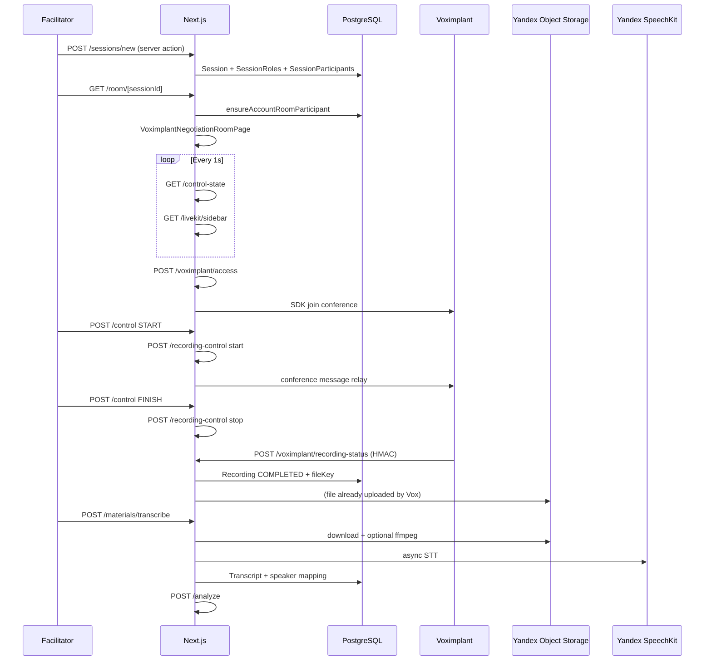
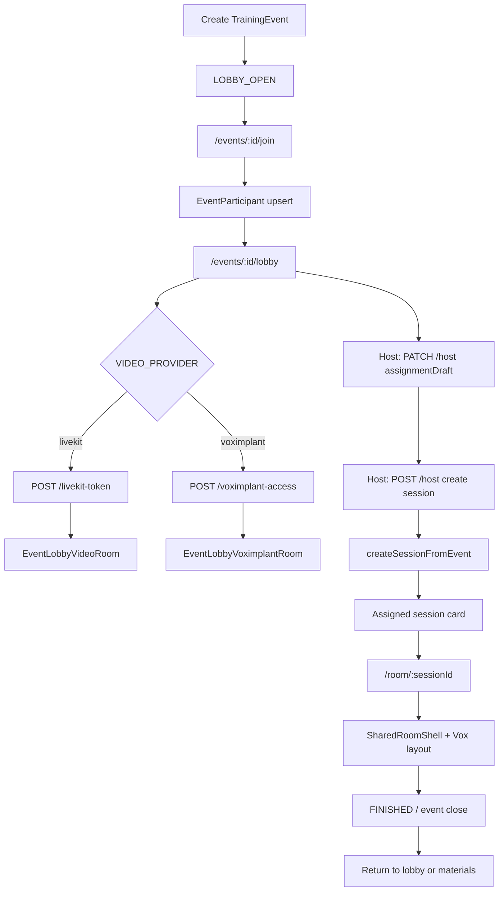

# Session Flow Gap Analysis

**Date:** 2026-07-03  
**Purpose:** Compare current Voximplant/Yandex POC session UX and domain flow against the original LiveKit-era behavior  
**Method:** Code inspection + prior parity audits (`docs/voximplant/session-flow-parity-audit.md`, stage 2/3 reports)  
**Rules:** Read-only; no code changes

---

## 1. Comparison baseline

| Aspect | Original (LiveKit-era) | Current (Vox POC) |
|---|---|---|
| Video provider | LiveKit only | `VIDEO_PROVIDER` switch; POC uses `voximplant` |
| Room UI | `VideoRoomPage` + `StructuredVideoLayout` | `VoximplantNegotiationRoomPage` + `VoximplantVideoLayout` inside `SharedRoomShell` |
| Event lobby media | LiveKit token only | LiveKit **or** Vox via `EventLobbyView` provider switch |
| Recording | LiveKit egress (server-side) | Vox scenario + browser `sendConferenceMessage` relay + webhook |
| Transcription / AI | OpenAI path | Yandex SpeechKit + Yandex AI (configurable) |
| Join model | joinToken + growing account-first mode | Account-first for room/lobby; joinToken redirect path retained |

**Important:** Several P0 gaps from the March 2026 parity audit (timer missing, lobby still LiveKit-only, generic Vox grid) have been **addressed in code** since that document was written. This analysis reflects **current** tree state.

---

## 2. Flow maps

### 2.1 Standalone session flow

### 2.2 Event → lobby → session → room

---

## 3. Feature parity matrix (current)

Legend: ✅ parity | ⚠️ partial | ❌ gap | 🔒 intentional change

| Feature | Original | Current | Status | Notes |
|---|---|---|---|---|
| Case → session creation | Domain service | Same `create-event-session.ts` | ✅ | Provider-agnostic |
| Event assignment validation | Facilitator/role/observer rules | Same | ✅ | |
| Session state machine | Server authority | Same `negotiation-control.ts` | ✅ | |
| Timer source of truth | DB timestamps + control-state | Same | ✅ | |
| Timer visible in room | Central in `StructuredVideoLayout` | `RoomTimerPanel` in `VoximplantVideoLayout` (desktop + mobile) | ✅ | Fixed since parity audit |
| Preparation auto-finish | Server auto-transition | Same | ✅ | |
| Facilitator controls | `FacilitatorRoomControls` in shell | Same via `SharedRoomShell` | ✅ | |
| Role briefings / notes | Sidebar | Same sidebar API | ✅ | |
| Facilitator role management (PREPARATION) | Panel in sidebar | Same | ✅ | |
| Structured 2-role layout | Table zones A / center / B + observers | Vox zones with keyword heuristics | ⚠️ | Non-standard role names → `unknown` zone |
| 4+ participants | Structured layout scales | Overflow → `unknown` zone + diagnostics | ⚠️ | |
| Observer row | Dedicated row | Dedicated observer section | ✅ | |
| Remote role labels | From DB roster | Roster-driven subtitles | ⚠️ | Depends on Vox username ↔ roster match |
| Remote speaking indicator | LiveKit `SpeakingActivityTracker` | Local user only (`micLevel`) | ❌ | Deferred in shell comments |
| Remote mic state | LiveKit track mute | Policy-derived (`resolveRemoteMicStateByPolicy`) | ⚠️ | Shows intent, not actual mute |
| Mic enforcement (RUNNING) | `MicEnforcement` component | Vox hook manual mute | ⚠️ | Policy enforced server-side; client UX differs |
| Camera policy | Allowed all phases | Same server flag | ✅ | |
| Recording on START | LiveKit egress auto | Vox relay after control START | ⚠️ | Fragile if relay fails silently |
| Recording consent UI | Required for start | Same in recording-control | ✅ | |
| Event lobby video | LiveKit | Vox lobby component added | ✅ | Fixed since parity audit |
| Lobby → room transition | Disconnect LiveKit | Browser lifecycle gate (`browser-client-lifecycle.ts`) | ⚠️ | Timing-sensitive; stage 2 fixes applied |
| Lobby duplicate participants | Possible if duplicate DB rows | Still possible | ❌ | No read-time dedupe |
| Lobby stale tab UX | N/A / weak | Banner + 409 on mutations; media may stay mounted | ⚠️ | |
| Account-only room join | Hardened | Enforced | 🔒 | joinToken redirects to account mode |
| Guest event lobby Vox | N/A | Rejected (403) | 🔒 | Must sign in |
| Materials visibility by role | Facilitator/participant/observer gates | Same API | ✅ | |
| AI share with observers | Share action | Same | ✅ | Verify on POC data |
| Session close → event lobby link | Overlay button | Same overlay | ✅ | |
| Debrief panel | In room after FINISHED | Same shell | ✅ | |
| Rejoin / stale connection | Lease per tab | In-memory lease 409 | ⚠️ | Single-process OK; multi-instance not |

---

## 4. Suspected missing or weakened legacy behaviors

### 4.1 Confirmed gaps (still open)

1. **Remote speaking highlights** — LiveKit had per-participant speaking activity; Vox room only highlights local mic level.
2. **True remote mute visibility** — Facilitator cannot see actual remote mute state on Vox tiles; labels reflect negotiation policy only.
3. **Reliable recording without browser relay** — Original LiveKit egress was server-initiated; Vox path fails if facilitator browser drops before relay.
4. **Event lobby participant deduplication** — Duplicate `EventParticipant` rows for same user can show duplicate cards.
5. **Role layout for non-standard case names** — Cases not using buyer/seller or "Participant A/B" naming fall into fallback/unknown slots.
6. **Multi-slot sessions (3+ negotiators)** — Original layout had semantics for larger groups; Vox layout is two-slot + overflow unknown.
7. **Full-chain automated regression on Vox** — No single E2E from event through Yandex materials on CI against POC.

### 4.2 Partially restored (verify on POC)

1. **Timer display** — Present in code; confirm visible on `app.negotaitions.ru` for all roles and mobile (`vox-zone-timer-mobile`).
2. **Role-zoned video layout** — Present on desktop (`lg:grid`); mobile collapses to stacked participants section.
3. **Event lobby Vox** — Endpoint exists; confirm identity provisioning works for all lobby users on POC.
4. **Lobby → room camera handoff** — Stage 2 lifecycle sequencing; re-test on production browsers.

### 4.3 Intentional product changes (not bugs)

1. Guest join closed for hardened room/lobby paths.
2. Account-first materials URLs (`/sessions/[id]/materials` vs `/join/[token]`).
3. Vox audio-only recording default (`VOXIMPLANT_RECORDING_AUDIO_ONLY=true`) — no composite video recording for review.

---

## 5. Role assignment deep dive

### Domain layer (sound)

`lib/create-event-session.ts`:

- Validates facilitator, all assignable case roles filled, no duplicate assignments.
- Prevents facilitator/player/observer conflicts.
- Snapshots `SessionRole` from case roles.
- Links `EventParticipant.assignedSessionParticipantId`.

### UI / transport layer (risk)

| Layer | Source of truth | Gap |
|---|---|---|
| Sidebar / API | `SessionParticipant.type`, `sessionRoleId` | ✅ |
| Vox access API role hint | Keyword match on `sessionRole.name` | ⚠️ Duplicates layout heuristics |
| Vox tile zones | `resolveRosterVisualRoles()` keywords + fallback sortOrder | ⚠️ Custom role names mis-slot |
| Unassigned participant | Shown as observer zone in layout | ⚠️ May confuse vs sidebar "waiting for role" |

**Recommendation:** Unify slot assignment on `SessionRole.sortOrder` (0 → A, 1 → B) at both `voximplant/access` and `room-layout-model.ts`.

---

## 6. Timer deep dive

| Concern | Finding |
|---|---|
| Backend | No gap — `lib/negotiation-control.ts` unchanged |
| Polling | 1s interval in room pages |
| Display | `RoomTimerPanel` shared component used by LiveKit and Vox layouts |
| Auto-expire | `shouldAutoFinish` / `shouldAutoFinishPreparation` in control route |
| Pause accounting | `SessionPauseInterval` + preparation pause fields |

**Suspected UX gap:** If facilitator reports "timer missing", check (a) mobile vs desktop layout, (b) `control-state` fetch errors, (c) stale JS bundle on POC — not missing server logic.

---

## 7. Recording quality / review implications

| Topic | Original | Current |
|---|---|---|
| Recording modality | Audio egress typical | Vox audio-only default |
| Video in recording | LiveKit composite possible | Disabled in POC env template |
| Audio processing | LiveKit egress settings | `VOXIMPLANT_RECORDING_AUDIO_MODE`, `VOXIMPLANT_AUDIO_PROCESSING_PROFILE` |
| Post-processing | ffmpeg always | Threshold skip for small compatible files (Stage 3) |
| Transcription input | OpenAI | SpeechKit with speaker labeling |

**Gap:** Training review that relied on **video recording** of body language is not replicated in POC config.

---

## 8. Observer / facilitator behavior

| Behavior | Enforced where | Vox UX match |
|---|---|---|
| Facilitator-only `/control` | API 403 | ✅ Controls hidden via `canControl` |
| Facilitator-only `/recording-control` | API 403 | ✅ |
| Observer notes | Sidebar | ✅ |
| Observer transcript (materials) | After AI share | ✅ API unchanged |
| Observer mic during RUNNING | `isMicAllowed` → false | ⚠️ Policy label only on Vox tiles |
| Facilitator briefings panel | Sidebar | ✅ |
| Recording indicator | Shared | ✅ |

---

## 9. High-risk files for session UX fixes

| Priority | File | Reason |
|---|---|---|
| P0 | `lib/voximplant/room-layout-model.ts` | Role slot mapping |
| P0 | `components/voximplant-video-layout.tsx` | Layout/timer presentation |
| P0 | `components/voximplant-negotiation-room-page.tsx` | Recording relay hooks |
| P1 | `lib/event-state.ts` | Lobby participant list shaping |
| P1 | `components/event-lobby-view.tsx` | Stale tab / provider bootstrap |
| P1 | `lib/voximplant/use-voximplant-room.ts` | Mic policy enforcement client-side |
| P1 | `app/api/sessions/[sessionId]/voximplant/access/route.ts` | Role hint to scenario |
| P2 | `components/shared-room-shell.tsx` | Shared orchestration — change carefully |
| P2 | `lib/negotiation-control.ts` | Do not break timer authority |

---

## 10. Manual test checklist (session UX)

| # | Scenario | Pass criteria |
|---|---|---|
| 1 | Event host creates session with 2 roles + observer | All roles correct in sidebar and materials |
| 2 | Each role enters room | Correct zone (A/B/facilitator/observer) on desktop |
| 3 | Mobile room | Timer + all participants visible without layout break |
| 4 | START preparation → auto finish → READY | Timer counts down; state messages match |
| 5 | START negotiation | Recording indicator → RECORDING; mic policy on observer/facilitator |
| 6 | PAUSE / RESUME | Timer pauses; mic locked on pause |
| 7 | FINISH | Debrief overlay; recording finalizes |
| 8 | Refresh mid-session | Same role, timer resumes from server, no duplicate Vox endpoint |
| 9 | Same user two tabs | Stale tab gets 409 / banner; only one controls |
| 10 | Lobby → room → back to lobby | No DISCONNECTING errors; camera re-acquires |
| 11 | Materials after session | Transcript speakers map to participant names |
| 12 | Observer share flow | Observer sees AI only after facilitator shares |

---

## 11. E2E tests to add (later)

| Spec | Scope |
|---|---|
| `voximplant-full-materials-chain.spec.ts` | Event → lobby → room → recording webhook mock → transcribe → analyze |
| `voximplant-role-slots.spec.ts` | Parametrize case role names; assert zone testids |
| `voximplant-timer-sync.spec.ts` | Two contexts; compare `room-server-timer` text vs API |
| Extend `session-lifecycle.spec.ts` | `VIDEO_PROVIDER` matrix fixture |

---

## 12. Recommendations (no code in this audit)

1. **Verify timer on POC first** — likely present; rule out deployment/cache before coding.
2. **Unify role slot mapping** on `SessionRole.sortOrder` — highest impact for "wrong role assignment" reports.
3. **Add event participant dedupe** in `buildEventState` — low-risk read path fix.
4. **Document recording relay dependency** for facilitators — START must succeed with open room tab.
5. **Capture ffprobe baseline** from one POC recording before tuning audio env vars.
6. **Split test suite** into domain (always run) vs provider (env-gated) for CI clarity.
7. **Do not refactor** `negotiation-control.ts` or webhook handler until UX gaps are validated manually.

---

## 13. Gap summary by priority

### P0 (demo / training club)

- Remote speaking / actual mute visibility on Vox tiles
- Recording reliability when facilitator browser unstable
- Role slot correctness for real case library (non-English role names)
- Full-chain POC smoke not yet scripted

### P1 (broader testing)

- Event lobby duplicate participant cards
- Stale tab still showing live media
- Mobile layout parity vs desktop zones
- Multi-instance lease store (if ever scaled)

### P2 (polish)

- Rename `/api/livekit/sidebar` to neutral name (API version bump)
- Align ops docs with custom auth env vars
- Optional video recording for review (product decision)
