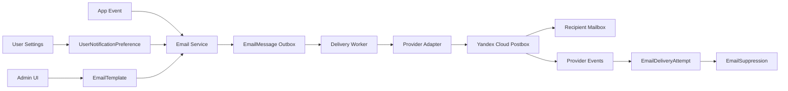

# Stage 3.13A - Email and User Communication Architecture Audit

Date: 2026-08-03
Branch: `docs/stage-3-13a-email-communication-audit`
Starting SHA: `d53cb0db84d4fe6ccf0eea277af7b30085dfea04`
Scope: audit and target architecture only. No runtime, Prisma migration, DNS, server configuration, or deployment changes.

## 1. Executive Summary

NegotAItions already stores email as the required account login and uses it as an access-control identifier for Event and Session invites. It does not currently have an outbound email sender, delivery provider, message queue, email templates, email verification, forgot-password flow, password-change notification, bounce processing, suppression list, or communication-preference model.

The recommended target is a staged architecture:

1. Use Yandex 360 for real human mailboxes, aliases, groups, and owner desktop/mobile inboxes under `@negotaitions.ru`.
2. Use Yandex Cloud Postbox as the preferred first transactional sender for application-originated email, because the project already runs on Yandex Cloud and Postbox provides SMTP and AWS SES-compatible API sending with DKIM/SPF/DMARC, Cloud Logging/Data Streams integration, and Russia-oriented compliance positioning.
3. Implement an application-level email outbox, delivery-attempt log, template registry, suppression list, and provider abstraction before adding individual flows.
4. Keep product and marketing communications gated behind explicit legal/product approval and separate consent. Transactional/security messages should not be user-disableable when required for account operation.

This audit does not implement any of the above.

## Confirmed Product Decisions for Stage 3.13B0

The Stage 3.13B0 readiness audit carries forward these approved decisions:

- DNS for `negotaitions.ru` is managed in Yandex Cloud DNS; no Yandex 360 organization or Postbox configuration exists yet.
- Current site operator is `Чаадаев Дмитрий Владимирович`, acting as an individual. Do not publish a residential address or additional personal information without separate legal approval.
- Initially one operator will receive `support@negotaitions.ru`, `security@negotaitions.ru`, and `business@negotaitions.ru`.
- Password reset for ACTIVE/APPROVED accounts may create a one-time token and send a reset email to the verified account address. BLOCKED/REJECTED accounts must not get reset tokens; they receive support-guidance email while public UI/API keeps anti-enumeration wording.
- Future Event invitations require mandatory date/time scheduling with `startsAt`, time zone, and duration or `endsAt`; no schema change is made in Stage 3.13B0.
- Standalone Session invitations may be emailed when an address is supplied, but must preserve current join-token/access authorization; a raw Session ID must not be sufficient for access.
- Retention defaults should start conventionally and be configurable later; `.env` is not edited in Stage 3.13B0.
- Email templates should be editable repository files, version-controlled, RU/EN, HTML/text, manifest-validated, initially scaffold-generated, and not admin-UI editable in the first implementation.

## 2. Inputs and Sources

Project inputs:

- `User Stories/Электронная почта.docx`
- `prisma/schema.prisma`
- `app/actions/auth.ts`
- `app/actions/account.ts`
- `app/actions/admin-users.ts`
- `app/actions/events.ts`
- `app/actions/sessions.ts`
- `lib/invite-email.ts`
- `lib/visibility.ts`
- `lib/auth/*`
- `lib/consent/cookie-consent.ts`
- `app/(app)/admin/users/page.tsx`
- `app/(app)/account/settings/page.tsx`
- legal pages under `app/privacy`, `app/terms`, `app/data-processing-consent`, `app/cookie-policy`
- materials and AI publication routes under `app/api/sessions/[sessionId]`
- service logging and maintenance code under `lib/services/*`, `lib/stage-3-10-maintenance.ts`, and `scripts/ops/stage-3-10-maintenance.ts`

Official provider sources checked on 2026-08-03:

- Yandex Cloud Postbox documentation: https://yandex.cloud/en/docs/postbox/
- Yandex Cloud Postbox overview: https://yandex.cloud/en/docs/postbox/concepts/
- Yandex Cloud Postbox quickstart: https://yandex.cloud/en/docs/postbox/quickstart
- Yandex Cloud Postbox send email: https://yandex.cloud/en/docs/postbox/operations/send-email
- Yandex Cloud Postbox service page: https://yandex.cloud/en/services/postbox
- Yandex 360 initial mail setup: https://yandex.com/support/yandex-360/business/admin/en/mail/start
- Yandex 360 MX setup: https://yandex.com/support/yandex-360/business/admin/en/domains/dns/mx
- Yandex 360 SPF setup: https://yandex.com/support/yandex-360/business/admin/en/domains/dns/spf
- Yandex 360 DKIM setup: https://yandex.com/support/yandex-360/business/admin/en/domains/dns/dkim
- Yandex Cloud DNS resource records: https://yandex.cloud/en/docs/dns/concepts/resource-record
- Yandex Cloud DNS record creation: https://yandex.cloud/en/docs/dns/operations/resource-record-create
- Amazon SES SMTP docs: https://docs.aws.amazon.com/ses/latest/dg/send-email-smtp.html
- Amazon SES suppression list docs: https://docs.aws.amazon.com/ses/latest/dg/sending-email-suppression-list.html
- Mailgun pricing and feature page: https://www.mailgun.com/pricing/
- Mailgun SMTP docs: https://documentation.mailgun.com/docs/mailgun/user-manual/sending-messages/send-smtp
- Mailgun webhooks docs: https://documentation.mailgun.com/docs/mailgun/user-manual/webhooks/webhooks
- SendGrid API vs SMTP docs: https://docs.sendgrid.com/for-developers/sending-email/web-api-vs-smtp
- SendGrid webhooks docs: https://docs.sendgrid.com/api-reference/webhooks
- Scaleway Transactional Email docs: https://www.scaleway.com/en/docs/transactional-email/
- Scaleway Transactional Email API: https://www.scaleway.com/en/developers/api/transactional-email
- Scaleway Transactional Email quickstart: https://www.scaleway.com/en/docs/transactional-email/quickstart/

## 3. Current State

### 3.1 User and Login Semantics

`User.email` is required and unique in `prisma/schema.prisma`. It is the login identifier and is used by registration, login, admin filtering, account display, invite matching, and bootstrap admin detection.

Current `User` fields relevant to communication:

- `email String @unique`
- `passwordHash String`
- `name String?`
- `globalRole String @default("USER")`
- `status String @default("PENDING_APPROVAL")`
- `preferredLocale String @default("ru")`
- approval/rejection/block timestamps and actor IDs
- `userConsents`
- sent and received `EventInvite` and `SessionInvite` relations

There is no separate verified email state, no notification email, no email change workflow, and no communication-preference model.

### 3.2 Registration, Login, Approval, and Passwords

Registration is implemented in `app/actions/auth.ts`:

- requires name, email, password, confirm password, locale, and three legal consent checkboxes;
- normalizes email with `normalizeEmail`;
- rejects duplicate email;
- hashes password with bcrypt;
- assigns bootstrap admins from `ADMIN_EMAILS` as `ACTIVE` and `ADMIN`;
- assigns other users `PENDING_APPROVAL`;
- creates three `UserConsent` records transactionally;
- creates an auth session immediately.

Login is implemented in `app/actions/auth.ts`:

- uses normalized email and password;
- returns a generic invalid-credentials error for missing/invalid email/password;
- upgrades bootstrap admin accounts on login if needed;
- redirects non-active users to pending/rejected/blocked pages.

Password change is implemented in `app/actions/account.ts`:

- requires the current password;
- enforces minimum length and confirmation;
- updates `passwordHash`;
- keeps the current session active;
- explicitly notes that invalidating other sessions is a future TODO.

Missing:

- forgot password;
- password reset tokens;
- password reset email;
- password-change notification;
- session revocation after password reset;
- email verification;
- email change verification;
- notification email verification;
- rate-limited password reset request endpoint;
- admin notification for new pending users;
- user notification on approval/rejection/block/unblock.

### 3.3 Legal and Consent

Server-side registration consent is stored in `UserConsent` with:

- `consentType`
- `version`
- `acceptedAt`
- `ipHash`
- `userAgent`

Consent constants live in `lib/consent/cookie-consent.ts`:

- `TERMS_PRIVACY_V1`
- `MVP_DATA_LIMITATION_V1`
- `EXTERNAL_INFRASTRUCTURE_V1`

Cookie preferences are client-side only in localStorage under `negotaitions.cookieConsent.v1` and currently include:

- necessary: always true;
- analytics: false by default;
- marketing: false by default.

The current cookie policy states analytics and marketing cookies are not currently used. Privacy and terms pages are still marked as MVP drafts and include placeholder contact/operator details.

There is no consent model for transactional/product/marketing email. There is no unsubscribe state.

Recording and AI-processing confirmations are also not durable communication consents today. They are captured as UI/API confirmation flags around recording and sharing flows, while `UserConsent` only records registration-time legal consents.

### 3.4 Event and Session Invites

Event invites:

- Models: `TrainingEvent`, `EventParticipant`, `EventInvite`.
- Creation/update code: `app/actions/events.ts`.
- Validation: `lib/validations/event.ts`.
- Access: `lib/visibility.ts`, `lib/event-auth.ts`, `lib/access-control.ts`.

Session invites:

- Models: `Session`, `SessionParticipant`, `SessionInvite`.
- Creation/update/add participant code: `app/actions/sessions.ts`.
- Validation: `lib/validations/session.ts`.
- Access: `lib/visibility.ts`, `lib/room-auth.ts`, `lib/access-control.ts`.

Both invite models support:

- registered user invite via `userId`;
- external email invite via `invitedEmail` and `invitedEmailNormalized`;
- sender via `invitedByUserId`;
- uniqueness by event/session plus user or normalized email.

`lib/invite-email.ts` only normalizes and validates addresses. It does not send email.

Current product copy explicitly reflects this: the English dictionary says "Email invitations are not sent yet. Added users will see this meeting in their list." This wording should remain until a real outbox/provider flow exists.

Important current access behavior:

- If a logged-in user's normalized email matches `invitedEmailNormalized`, `lib/visibility.ts` can grant visibility.
- For account-mode room access, `joinToken` should not be exposed in client HTML for logged-in users.
- `participantToken`, `hostToken`, and `joinToken` are access-bearing tokens and must not be sent in email without a deliberate signed-link policy.

### 3.5 Materials and AI Publication

Session materials and AI status are exposed through:

- `app/api/sessions/[sessionId]/materials/status/route.ts`
- `app/api/sessions/[sessionId]/ai-analysis/share/route.ts`
- `app/api/sessions/[sessionId]/ai-analysis/unshare/route.ts`
- `lib/materials-ai-analysis-view.ts`
- `lib/materials-status-readiness.ts`
- `lib/analysis-visibility.ts`
- `lib/privacy/serializers`

Current publication model:

- Facilitators can run transcription and AI analysis.
- AI analysis starts as `FACILITATOR_ONLY`.
- Sharing changes `AiAnalysis.visibility` to `SHARED_WITH_SESSION`.
- Shared analysis is sanitized before publication.
- Observers see transcript only after shared AI analysis, except event owner/host cases handled by the existing access logic.
- Participants receive filtered personal feedback when shared.
- Raw storage keys are not exposed to participant/observer clients; signed download URLs are short lived.

Email result notifications must respect this model. A "results published" email should link back to the authenticated Session/materials page, not embed transcripts, recordings, private role data, raw provider errors, storage keys, access tokens, or full AI JSON.

### 3.6 Admin UI and Observability

Current admin surfaces:

- `app/(app)/admin/users/page.tsx`: user search/filter/status/role actions.
- `app/actions/admin-users.ts`: approve, reject, block, unblock, make admin, remove admin.
- `AdminActionLog`: records admin user management actions.
- `app/(app)/admin/log/page.tsx`: shows service events through `AdminDiagnosticsView`.
- `ExternalServiceEvent`: logs external-service failures.
- `UsageCounter`: tracks provider usage.
- `AppSetting`: generic key/value storage.

Current gaps:

- no service address management;
- no sender identities;
- no reply-to configuration;
- no email templates;
- no delivery log;
- no retry failed email UI;
- no suppression list;
- no unsubscribe status;
- no test email;
- no RU/EN template preview;
- no pending approval email notification to admins.

### 3.7 Background Jobs and Retry Patterns

No general-purpose job queue or email queue exists.

Useful existing patterns:

- `SessionRecordingStopOperation` models an operation with state, attempt count, last error, next retry, and delivery transport.
- `lib/stage-3-10-maintenance.ts` performs sweep-based retry and cleanup.
- `scripts/ops/stage-3-10-maintenance.ts` is the CLI entry point.
- `ExternalServiceEvent` provides provider failure logging.

These patterns are good references for an email outbox, but email delivery should be modeled separately rather than sharing recording-stop tables or lifecycle maintenance code.

## 4. Current Gaps and Risks

High-priority gaps:

- No email verification for login email.
- No forgot-password or password-reset flow.
- No password-change email notification.
- No admin notification when users await approval.
- No outbound provider or abstraction.
- No durable email outbox, retry, idempotency, delivery attempt log, or suppression list.
- No bounce/complaint handling.
- No product/marketing consent model.
- No real contact addresses in legal pages; placeholders remain.
- No service address matrix or owner mailbox plan.
- Existing deployment/runtime docs contain some stale or aspirational communication references, including old auth terminology and assumptions about invite/email links. Stage 3.13B should clean those docs when runtime implementation begins.

Security and privacy risks if email is added directly:

- sending access-bearing `hostToken`, `participantToken`, or `joinToken` without TTL/scope would create durable bearer links in inboxes;
- sending AI results or transcripts inline could leak private role data or facilitator-only data;
- forgot-password without anti-enumeration and rate limiting would expose account existence and brute-force surfaces;
- email change without verification could cause account takeover or notification leakage;
- provider webhooks without signature validation could poison delivery state;
- template rendering without HTML escaping could create injection/phishing risk;
- no suppression list would harm domain reputation after bounces/complaints.

Existing auth/admin follow-up risk that should be addressed before or alongside account-security email flows: page-level `requireAdminUser()` blocks non-bootstrap admins that are `BLOCKED` or `REJECTED`, but admin API guards should be re-checked to ensure they apply the same status restrictions and do not rely only on `isAdmin()`.

## 5. Communication Taxonomy

### 5.1 Transactional

Examples:

- registration confirmation;
- email verification;
- forgot password;
- password reset completed;
- password changed;
- admin approval/rejection/block/unblock;
- Event invitation;
- Session invitation;
- reminder;
- Session completed;
- materials published;
- AI analysis shared.

Policy:

- Required when necessary for account operation or security.
- Not user-disableable for security/account-critical messages.
- Uses minimal data and links back to authenticated pages.
- Must be auditable.
- Must support retry, idempotency, bounce handling, and suppression except for security exceptions that require explicit policy.

### 5.2 Operational

Examples:

- provider errors;
- failed background jobs;
- recording/transcription failures;
- AI processing failures;
- pending users requiring admin approval;
- security alerts;
- support and abuse requests.

Policy:

- Sent to internal operational recipients or groups.
- Not governed by user marketing consent.
- Must avoid leaking secrets, raw tokens, or sensitive transcripts.
- Should support alert severity and deduplication.

### 5.3 Product

Examples:

- release notes;
- product changes;
- new features;
- service availability notices that are not account-critical.

Policy:

- Requires explicit product-communication preference.
- Must support unsubscribe.
- Should be separate from marketing campaigns.

### 5.4 Marketing

Examples:

- event promotion;
- special offers;
- service announcements;
- broad campaigns.

Policy:

- Requires explicit marketing consent.
- Must support unsubscribe and suppression.
- Must not be implemented until separate legal/product approval.

## 6. Address, Mailbox, Alias, and Sender Matrix

Recommended initial matrix:

| Address | Type | Public | Owner / Recipient | Use | Reply-To |
| --- | --- | --- | --- | --- | --- |
| `no-reply@negotaitions.ru` | automated sender | no | app only | password/security/system notices where replies are not useful | `support@negotaitions.ru` |
| `notifications@negotaitions.ru` | automated sender | no | app only | transactional notifications and reminders | `support@negotaitions.ru` |
| `invitations@negotaitions.ru` | automated sender | no | app only | Event/Session invitations | event host/facilitator or `support@` |
| `support@negotaitions.ru` | real mailbox or group | yes | owner/support | user support, footer, error pages | itself |
| `errors@negotaitions.ru` | alias/group | no | admin/ops | user-reported errors and operational alerts | `support@` |
| `security@negotaitions.ru` | real mailbox or alias with controlled access | yes | owner/security | security reports and sensitive account issues | itself |
| `admin@negotaitions.ru` | alias/group | no | admins | pending approval and internal admin alerts | itself |
| `business@negotaitions.ru` | real mailbox or alias | yes | owner | business inquiries | itself |
| `analytics@negotaitions.ru` | alias | no | owner/ops | Yandex/site metrics registration and reports | itself |
| `marketing@negotaitions.ru` | future sender/mailbox | later | owner/marketing | campaigns after approval | `support@` or campaign-specific |

Owner desktop/mobile setup should include real human mailboxes, not automated senders:

- `support@negotaitions.ru`
- `security@negotaitions.ru`
- `business@negotaitions.ru`
- possibly `admin@negotaitions.ru` as an alias/group to the owner mailbox

Automated senders should be configured in provider/domain settings and not used as daily inboxes.

## 7. Provider and Infrastructure Comparison

### 7.1 Yandex-Native Architecture

Components:

- Yandex 360 for inbound mailboxes, aliases, groups, owner desktop/mobile mail.
- Yandex Cloud Postbox for outbound transactional/product/marketing email.
- Yandex Cloud DNS or current DNS host for MX, SPF, DKIM, DMARC, verification records.
- Yandex Cloud Logging/Data Streams for Postbox event export if enabled.

Official capabilities found:

- Postbox supports SMTP and AWS SES-compatible API sending.
- SMTP host is `postbox.cloud.yandex.net`; official docs list STARTTLS port 587 and SMTPS port 465.
- Postbox uses TLS 1.2/1.3.
- Postbox supports DKIM setup and domain verification.
- Postbox SPF record uses `include:spf.postbox.yandexcloud.net`.
- DMARC is configured as a DNS TXT record.
- Postbox can integrate with Cloud Logging and Data Streams for sending/delivery events.
- Service page advertises first 2,000 emails/month free and volume pricing.
- Docs and service page position the service for transactional emails, notifications, informational and marketing newsletters.

Pros:

- Best fit with current Yandex Cloud production stack.
- Strongest Russia/data-location alignment among checked options.
- Avoids running a custom SMTP server.
- Supports SMTP now and API later.
- Operational model can reuse Yandex IAM, Lockbox/secret storage, Cloud Logging and monitoring.

Risks/open checks:

- Confirm current quota for the actual cloud account and folder.
- Confirm whether Postbox event logs include enough structured bounce/complaint data for suppression automation.
- Confirm webhook/event pipeline shape and retention before implementation.
- Confirm availability, billing account, and support path in the production cloud.

### 7.2 Yandex 360 for Mailboxes

Official capabilities found:

- For corporate mail, Yandex 360 requires DNS setup.
- MX: `mx.yandex.net.` priority 10.
- SPF: `v=spf1 redirect=_spf.yandex.net` for Yandex 360 only, or include-based composition when multiple senders are used.
- DKIM: generated under the Yandex 360 domain page, added as `mail._domainkey` TXT.
- Domain delegation to Yandex can automate records.

Important DNS note:

If both Yandex 360 and Postbox send mail for `@negotaitions.ru`, SPF must be a single TXT record that composes both authorized senders. Do not create multiple SPF TXT records. The final SPF must be validated against DNS lookup limits and provider docs.

### 7.3 Separate Transactional Provider plus Yandex 360

Candidate providers checked at a high level:

- Amazon SES
- Mailgun
- SendGrid
- Scaleway Transactional Email

Pros:

- Mature APIs, webhooks, suppression, templates, analytics.
- Some providers have stronger developer tooling or regional options.
- Provider abstraction could enable failover or migration.

Cons:

- Additional legal/data-location review.
- Potential sanctions/payment/availability uncertainty depending on provider and Russia context.
- More DNS alignment work.
- More operational complexity than Yandex-native first phase.

Recommendation:

Do not choose a non-Yandex provider for first implementation unless Postbox cannot satisfy verified bounce/complaint, quota, or account availability requirements. Still design a provider abstraction so later migration is possible.

### 7.4 Self-Hosted SMTP

Recommendation: do not use by default.

Reasons:

- IP reputation, rDNS, SPF/DKIM/DMARC, abuse handling, queue tuning, bounces, complaints, deliverability, and blocklist remediation become operational responsibilities.
- It distracts from product functionality.
- The project has no current mail operations team or SMTP infrastructure.

## 8. DNS and Domain Plan

Target domain: `negotaitions.ru`.

Records to plan, not apply in this audit:

- MX for Yandex 360 inbound mail.
- SPF single TXT record authorizing all outbound senders.
- DKIM for Yandex 360 mailbox sending.
- DKIM for Postbox sender domain/address.
- DMARC TXT record under `_dmarc.negotaitions.ru`.
- Optional CNAME/TXT records required by chosen provider.
- Optional subdomains for technical return path or provider alignment if supported.

Recommended rollout:

1. Inventory current DNS records from registrar/Yandex Cloud DNS.
2. Decide whether DNS is managed in Yandex Cloud DNS or elsewhere.
3. Add Yandex 360 mailboxes/aliases first.
4. Add Postbox sending domain in staging/low-risk mode.
5. Start DMARC with `p=none` and reporting if supported.
6. Move to stricter DMARC only after verified alignment and stable delivery.

## 9. Target Logical Architecture

Core concepts:

- Domain events request emails; they do not call the provider directly.
- `EmailMessage` is the durable outbox row.
- `EmailDeliveryAttempt` stores provider responses and retry state.
- Provider adapter hides SMTP/API differences.
- Templates are versioned and locale-aware.
- Suppression is checked before enqueue and before send.
- Transactional/security messages have explicit override policy, not blanket bypass.
- Admin UI can inspect and retry failed messages.
- Add `EMAIL` or a more specific mail-provider value to the service/error taxonomy before logging provider failures through `ExternalServiceEvent`.
- Prefer a DB outbox plus systemd timer or dedicated worker, using the Stage 3.10 maintenance pattern as inspiration. Do not send batches inline from interactive HTTP requests.

## 10. Data Model Proposal

Do not implement in Stage 3.13A. Candidate entities:

### EmailAddress

Purpose:

- Store login email and optional notification email with verification state.

Fields:

- `id`
- `userId`
- `email`
- `emailNormalized`
- `kind`: LOGIN, NOTIFICATION
- `isPrimary`
- `isVerified`
- `verifiedAt`
- `createdAt`
- `updatedAt`

### UserNotificationPreference

Purpose:

- Store per-user preferences and consents.

Fields:

- `userId`
- `transactionalEnabled` or implicit true
- `productUpdatesEnabled`
- `eventAnnouncementsEnabled`
- `marketingEnabled`
- `digestFrequency`
- `preferredLocale`
- timestamps and source of consent.

### EmailVerificationToken

Purpose:

- Verify login email changes and additional notification emails.

Fields:

- `tokenHash`
- `userId`
- `emailNormalized`
- `purpose`
- `expiresAt`
- `usedAt`
- `createdAt`

### PasswordResetToken

Purpose:

- Forgot-password flow.

Fields:

- `tokenHash`
- `userId`
- `expiresAt`
- `usedAt`
- `createdAt`
- `requestIpHash`
- `requestUserAgent`

### EmailMessage

Purpose:

- Durable outbox.

Fields:

- `id`
- `messageType`
- `status`
- `userId`
- `toEmailNormalized`
- `fromAddress`
- `replyToAddress`
- `locale`
- `templateKey`
- `templateVersion`
- `subject`
- `bodyText`
- `bodyHtml`
- `metadata`
- `idempotencyKey`
- `nextAttemptAt`
- `createdAt`
- `sentAt`
- `cancelledAt`

### EmailDeliveryAttempt

Purpose:

- Provider attempt log.

Fields:

- `emailMessageId`
- `provider`
- `providerMessageId`
- `attemptNumber`
- `transport`
- `status`
- `errorCode`
- `errorMessage`
- `rawResponse`
- `createdAt`

### EmailTemplate

Purpose:

- Admin-managed or code-managed template registry.

Fields:

- `key`
- `version`
- `locale`
- `subjectTemplate`
- `textTemplate`
- `htmlTemplate`
- `status`
- `createdByUserId`
- `updatedAt`

### EmailSuppression

Purpose:

- Suppress hard bounces, complaints, unsubscribes.

Fields:

- `emailNormalized`
- `reason`
- `source`
- `messageTypeScope`
- `createdAt`
- `expiresAt`
- `metadata`

### CommunicationCampaign

Purpose:

- Future product/marketing batches only.

Stage:

- Not part of first runtime implementation.

### Notification

Purpose:

- In-app notification counterpart for email.

Stage:

- Optional, useful if reminders/results should also appear in UI.

### AdminContactConfiguration

Purpose:

- Store public and private service contact addresses.

Fields:

- support/business/security/admin/error/analytics addresses;
- publication flags;
- owner notes;
- updatedBy.

## 11. Security Threat Model

Required controls:

- Password reset tokens must be random, single-use, hashed at rest, and short-lived.
- Password reset request response must be anti-enumeration: same user-facing response whether account exists or not.
- Reset requests must be rate-limited by email hash, IP hash, and user account.
- Successful password reset should invalidate other user sessions.
- Password-change notification should go to verified login/notification email and should not include the new password.
- Email verification tokens must be single-use and scoped to purpose.
- Email change should require verification of the new email and preferably notify the old email.
- Additional notification email must be verified before use.
- Provider webhook endpoints must validate signatures or shared secrets and reject replay where possible.
- Templates must escape variables by default.
- HTML emails should use an allowlisted component/template system, not arbitrary admin HTML in the first phase.
- Links must be HTTPS and use the canonical production host.
- Invitation/result links should not embed permanent bearer tokens unless explicitly scoped and TTL-bound.
- Suppression list must be checked before sending product/marketing and normal transactional email.
- Provider credentials must be stored in env/secret storage, rotated, and never printed.
- Failed delivery logs must avoid full PII, tokens, raw transcript, raw AI prompt, or storage keys.

## 12. Password Reset Target Flow

1. User opens "Forgot password".
2. User submits email.
3. Server normalizes email, applies rate limits, and always shows a neutral response.
4. If user exists and account is not blocked beyond recovery policy, create `PasswordResetToken`.
5. Enqueue `PASSWORD_RESET_REQUESTED`.
6. User opens one-time link.
7. Server validates token hash, TTL, used state, and user status.
8. User sets a new password.
9. Server updates hash, marks token used, invalidates other sessions, logs security event.
10. Enqueue `PASSWORD_RESET_COMPLETED` or `PASSWORD_CHANGED`.

Admin approval interaction:

- `PENDING_APPROVAL` users may reset password, but reset must not activate the account.
- `BLOCKED` users need a policy decision: either disallow reset with neutral response or allow reset but keep blocked. Recommended first policy: allow neutral request but do not reveal status; reset page should fail with support guidance if the account is blocked.
- `REJECTED` users need product/legal decision.

## 13. Invitation, Reminder, and Result Flows

### Event Invitation

Trigger:

- Event created or updated with new invited users/emails.

Recommended payload:

- Event title.
- Scheduled time and timezone if set.
- Host/facilitator display name.
- CTA to log in or register.
- No `hostToken`.
- Avoid raw `participantToken` unless a signed, scoped, expiring invite-link model is added.

### Session Invitation

Trigger:

- Standalone Session created or participant added.

Recommended payload:

- Session title.
- Case title if safe.
- Role only if assigned and safe for recipient.
- CTA to log in.
- No `joinToken` in first account-only implementation.

### Reminder

Trigger:

- Scheduler before `scheduledAt`.

Requirements:

- Needs scheduler/worker.
- Idempotency key per event/session/user/reminder offset.
- Respect participant state and cancellation/completion.

### Results Published

Trigger:

- AI analysis shared, materials ready, or facilitator explicitly publishes.

Recommended payload:

- "Materials are available" notification.
- Link to authenticated Session materials page.
- No transcript/AI result inline.
- No raw recording URL or storage key.
- Respect `AiAnalysis.visibility` and current participant access.

## 14. Admin UI Target Model

Stage 3.13E target:

- service addresses and publication flags;
- sender identities;
- reply-to defaults;
- templates list with RU/EN preview;
- send test email;
- notification type enable/disable;
- delivery status and details;
- retry failed messages;
- suppression list;
- unsubscribe status;
- pending approval alert configuration;
- support/business/security contact settings;
- admin action audit log for all email configuration changes.

Not in first implementation:

- full marketing automation;
- segmentation engine;
- campaign builder;
- arbitrary HTML editor without sanitization.

## 15. User Settings Target Model

Stage 3.13F target:

- login email display and change request;
- additional notification email;
- verification status;
- preferred language;
- transactional/security notices explanation;
- product updates consent;
- event announcements consent;
- marketing consent;
- unsubscribe controls for optional categories;
- digest frequency if reminders/results become noisy.

Non-disableable:

- password reset;
- password changed;
- security alerts;
- admin approval/rejection/block where operationally required;
- invitations required for access if email invite is the chosen delivery path.

## 16. Delivery Queue, Retry, and Idempotency

Recommended worker model:

- Enqueue message inside the same transaction as business state where consistency matters.
- Use `idempotencyKey` to prevent duplicate invites/reminders/results.
- Send asynchronously.
- Store provider message ID.
- Use exponential backoff with capped attempts.
- Separate permanent failures from retryable failures.
- Process provider events to update final status.
- Keep manual retry for admin.

Reference pattern:

- `SessionRecordingStopOperation` and `runRecordingStopDeliverySweep` already model state, attempts, retry timing, and transport result. Email should adopt the pattern conceptually, not reuse the same model.

## 17. Bounce, Complaint, and Suppression

Minimum model:

- hard bounce: suppress address for normal transactional/product/marketing; admin can override only with verification;
- complaint: suppress marketing/product and likely all non-security messages;
- unsubscribe: suppress optional categories only;
- soft bounce: retry according to provider guidance, then mark failed;
- provider rejection: store details and decide suppression based on code.

Yandex Postbox open check:

- Confirm whether Cloud Logging/Data Streams events expose enough bounce/complaint classification for automatic suppression.
- If not, first implementation may need manual failed-delivery review and a simple suppression admin UI before marketing/product mail.

## 18. Logging and Observability

Use:

- `EmailMessage` for user-visible status.
- `EmailDeliveryAttempt` for provider attempts.
- `ExternalServiceEvent` for aggregated provider failures.
- `UsageCounter` for sent volume, bounces, complaints, and provider cost estimates.
- Admin log page extension for email provider errors.

Avoid:

- logging full email body for sensitive messages;
- logging reset tokens;
- logging invite/access tokens;
- logging raw transcript or AI JSON in provider metadata.

## 19. Cost and Operations

Yandex Cloud Postbox:

- Service page advertises 2,000 emails/month free and volume pricing after that.
- Actual quota and pricing must be verified in the production billing account before implementation.

Yandex 360:

- Mailbox and domain-mail pricing must be verified against current Yandex 360 plan.

Operational owners:

- Owner/admin: mailbox setup, support/security/business inbox review, legal text approval.
- Engineering: outbox, provider adapter, templates, webhook/event processing, monitoring.
- Product/legal: consent categories, marketing/product communication policy, footer/legal contacts.

## 20. Phased Implementation Plan

### Stage 3.13B - Provider Foundation

- Decide DNS host and provider.
- Configure Yandex 360 mailboxes/aliases.
- Configure Postbox sender domain in Yandex Cloud.
- Add DNS records in a controlled rollout.
- Add provider abstraction.
- Add `EmailMessage`, `EmailDeliveryAttempt`, `EmailSuppression`.
- Add queue/sweep worker and provider failure logging.
- Add first test email admin-only path.

### Stage 3.13C - Account Security Flows

- Email verification.
- Forgot password.
- Password reset.
- Password-change notification.
- Admin approval notification to admins.
- Approval/rejection/block notification to users.
- Session revocation after reset.

### Stage 3.13D - Event and Session Communications

- Event invitations.
- Session invitations.
- Reminder scheduler.
- Results/materials published notifications.
- Idempotent resend.

### Stage 3.13E - Admin Email Configuration

- Service address configuration.
- Template list and preview.
- Delivery status.
- Retry failed messages.
- Suppression list.
- Support/business/security contact settings.

### Stage 3.13F - User Preferences

- Notification email.
- Verification state.
- Optional communication preferences.
- Unsubscribe handling.
- Digest frequency if needed.

### Stage 3.13G - Product and Marketing

- Only after separate legal/product approval.
- Campaign model.
- Marketing consent and unsubscribe enforcement.
- Higher deliverability review.

## 21. Test Strategy

Unit tests:

- email normalization;
- template rendering and HTML escaping;
- idempotency key generation;
- suppression decisions;
- provider adapter error classification;
- token generation, hashing, TTL, and single-use semantics.

Integration tests:

- registration creates verification email when enabled;
- forgot-password anti-enumeration;
- reset token invalidation;
- password reset invalidates sessions;
- admin approval notifications;
- invite enqueue idempotency;
- provider webhook signature validation.

E2E tests:

- forgot-password flow;
- email verification flow;
- admin approval notification path with mocked provider;
- Event/Session invite path with mocked provider;
- result publication notification path with mocked provider.

Do not use real provider in standard CI. Provide a separate manual smoke for Postbox after DNS/provider setup.

## 22. Migration and Rollout Strategy

No schema migration in Stage 3.13A.

Future rollout:

1. Add schema behind code that does not send real email.
2. Add mocked provider and test mode.
3. Add admin test email.
4. Enable security transactional flows first.
5. Enable invitations for internal users.
6. Enable external email invites.
7. Enable reminders and result notifications.
8. Enable optional product communications only after consent UI and legal approval.

Backfill:

- Existing users should start with `loginEmailVerified=false` unless a product decision treats legacy admin-created users differently.
- Existing `UserConsent` remains legal registration consent, not marketing consent.
- Existing Event/Session invites can remain as access grants; do not retroactively email them unless explicitly requested.

## 23. Open Questions

Product/legal:

- What legal entity/operator and contact details should appear in legal pages?
- Which communication types are mandatory?
- Can blocked/rejected users use forgot-password?
- Should invitation links require login only, or allow signed expiring registration/join links?
- What retention period is required for email message bodies and delivery logs?
- What consent text is required for product and marketing messages?

Infrastructure:

- Is `negotaitions.ru` DNS hosted in Yandex Cloud DNS or elsewhere?
- Is Yandex 360 already available for the domain?
- Is Yandex Cloud Postbox enabled in the production cloud and billing account?
- What are the current account quotas and support escalation path?
- Which secret store should hold provider credentials?

Engineering:

- Should templates be code-owned first or admin-editable from the start?
- Should queue processing run inside Next.js route/cron, systemd timer, or separate worker?
- What canonical URL builder should be used for email links?
- How should provider events be authenticated and routed?

## 24. Audit Conclusion

The project is ready for email architecture design but not ready for direct email integration. The safe next step is Stage 3.13B: provider/domain foundation plus application outbox and logging. Account security flows should come before invitations and reminders, because email verification, password reset, suppression, and delivery observability are foundational for all later communications.

The first runtime implementation should remain narrow: Yandex-native outbound via Postbox, Yandex 360 inbound mailboxes, account/security transactional emails, and a durable outbox. Product and marketing should remain deferred until explicit consent, legal text, unsubscribe, and operational ownership are complete.
