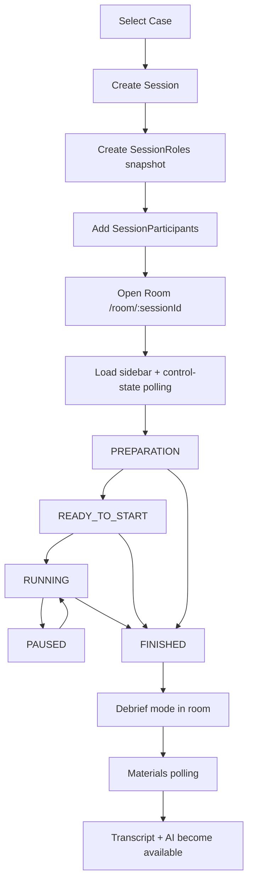
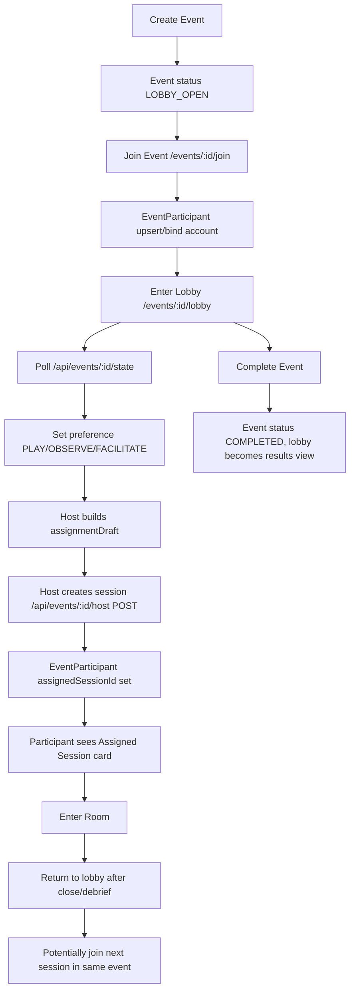

# Domain and Session Architecture Map (Stage 5.5A)

## 1) Product/domain overview

NegotAItions models negotiation training as:

- `NegotiationCase`: reusable scenario template with role briefs and default durations.
- `Session`: concrete training run (timed preparation + negotiation + debrief) bound to a case snapshot.
- `TrainingEvent`: umbrella "club event" that can host multiple sessions over time.
- `SessionParticipant` and `EventParticipant`: per-session and per-event identity/assignment layers.
- `Recording` -> `Transcript` -> `AiAnalysis`: post-session material pipeline.

Current branch (`exp/yandex-voximplant-main-room`) is mixed-mode:

- Domain orchestration (roles, control state, event/session lifecycle, materials polling) remains shared and mostly LiveKit-era.
- Room media provider is split by `VIDEO_PROVIDER`: LiveKit path still present, Voximplant path added.
- Voximplant recording relay path is implemented and working end-to-end (webhook -> transcription -> analysis).

Baseline reference used for this discovery:

- Branch/commit: `exp/yandex-ai-local` @ `31c4fe3`
- Source-of-truth retrieval method: `git show 31c4fe3:<path>` from current repo.

## 2) Domain entity map

## Core entities (Prisma)

- `User`: account, status (`PENDING_APPROVAL|ACTIVE|...`), global role, locale, auth/session relations.
- `NegotiationCase`: title/context/public instructions, defaults, visibility, owner/facilitator.
- `CaseRole`: role template entries for a case.
- `Session`: case snapshot + negotiation state machine + timers + optional `eventId`.
- `SessionRole`: session-level role snapshot copied from case roles.
- `SessionParticipant`: per-session actor (`PARTICIPANT|OBSERVER|FACILITATOR`) with optional `sessionRoleId`, `joinToken`, optional `userId`, optional `eventParticipantId`.
- `TrainingEvent`: event host/facilitator, lobby status, selected case, assignment draft.
- `EventParticipant`: event lobby identity, preference flags, assignment pointers to session/session participant.
- `EventInvite` / `SessionInvite`: invite surfaces for accounts/emails.
- `Recording`: provider recording state + object storage pointer.
- `Transcript` + `TranscriptSegment`: text/diarization/mapping status and content.
- `AiAnalysis`: analysis status + visibility/share payloads.

## Role/facilitator/observer semantics

- Facilitator authority is enforced at API layer by `SessionParticipant.type === FACILITATOR` for control/recording endpoints.
- Observer behavior:
  - In room: notes and watch mode, no facilitator controls.
  - In materials: transcript visibility gated by AI share state (`SHARED_WITH_SESSION`).
- Participant role assignment:
  - `SessionParticipant.sessionRoleId` is authoritative.
  - Explicit unassigned state exists and is surfaced in sidebar/notes lock behavior.

## 3) Current route map

## Primary app routes

- Cases: `/cases`, `/cases/new`, `/cases/[id]`, `/cases/[id]/edit`
- Sessions: `/sessions`, `/sessions/new`, `/sessions/[id]`, `/sessions/[id]/materials`
- Events: `/events`, `/events/new`, `/events/[id]/edit`, `/events/[id]/join`, `/events/[id]/lobby`, `/events/join/[publicJoinCode]`
- Room/session entry:
  - `/room/[sessionId]` (account mode first; guest joinToken migration redirect path still supported)
  - `/join/[joinToken]` -> binds account and redirects to `/sessions/[id]/materials`

## Room provider split

- `app/room/[sessionId]/page.tsx`
  - Chooses provider via `getVideoProvider()`.
  - Voximplant: `VoximplantNegotiationRoomPage`
  - LiveKit: `VideoRoomPage`

## Voximplant implementation points (current)

- Room UI shell: `components/voximplant-negotiation-room-page.tsx`
- Provider-neutral orchestration shell: `components/shared-room-shell.tsx`
- Vox media hook: `lib/voximplant/use-voximplant-room.ts`
- Vox video grid: `components/voximplant-video-layout.tsx`
- Vox access handshake: `app/api/sessions/[sessionId]/voximplant/access/route.ts`
- Vox recording relay:
  - client relay + control endpoint: `app/api/sessions/[sessionId]/recording-control/route.ts`
  - message builder/persistence helpers: `lib/voximplant/recording-dispatch.ts`
  - webhook ingest: `app/api/sessions/[sessionId]/voximplant/recording-status/route.ts`
- Debug panel (must stay): `components/recording-debug-panel.tsx` + `app/api/debug/recording/[sessionId]/route.ts`

## Shared orchestration APIs (provider-agnostic domain behavior)

- Session control/timers: `app/api/sessions/[sessionId]/control/route.ts`, `control-state/route.ts`, `lib/negotiation-control.ts`
- Sidebar/role resolution: `app/api/livekit/sidebar/route.ts` (name remains LiveKit-prefixed but currently acts as shared sidebar serializer)
- Event state/host/participant/lobby:
  - `app/api/events/[id]/state/route.ts`
  - `app/api/events/[id]/host/route.ts`
  - `app/api/events/[id]/participant/route.ts`
  - `app/api/events/[id]/livekit-token/route.ts` (still LiveKit-specific for lobby video)
- Materials status polling: `app/api/sessions/[sessionId]/materials/status/route.ts`

## 4) Old baseline route map (`31c4fe3`)

- Room stack was LiveKit-centric only:
  - `/room/[sessionId]` -> `VideoRoomPage`
  - No Voximplant room component/hook/access route.
- Event lobby/video was also LiveKit:
  - `components/event-lobby-view.tsx` fetched `/api/events/[id]/livekit-token`.
- Domain routes already existed with mostly same paths:
  - sessions/events/control/materials/status endpoints.
- No Vox debug-recording API/panel path family.

In short: baseline architecture already had the domain state machines and event/session model; current branch adds Vox room + Vox recording transport while keeping most old route contracts.

## 5) Session lifecycle diagram (Mermaid)



## 6) Event/lobby/join lifecycle diagram (Mermaid)



## 7) Recording lifecycle diagram (working — do not change without reason)

```mermaid
flowchart TD
  A[Facilitator START in room] --> B[/api/sessions/:id/control START]
  B --> C[Vox room callback triggers /recording-control start]
  C --> D[scenarioMessage returned]
  D --> E[Browser sendConferenceMessage to VoxEngine]
  E --> F[Recording row STARTING/RECORDING]
  F --> G[Facilitator FINISH]
  G --> H[/recording-control stop]
  H --> I[stop scenarioMessage relayed]
  I --> J[Recording STOPPED]
  J --> K[Vox webhook /voximplant/recording-status]
  K --> L[HMAC validated + fileKey normalized]
  L --> M[Recording COMPLETED]
  M --> N[materials/status polling sees ready]
  N --> O[Transcription]
  O --> P[AI Analysis]
```

**Status:** working green path; preserve unless a clearly scoped reason exists.

## 8) Provider migration boundary

## Domain logic that should survive provider migration

- Cases/sessions/events/invites/assignments (`NegotiationCase`, `Session`, `TrainingEvent`, participant relations).
- Negotiation state machine and timers (`lib/negotiation-control.ts`, control routes).
- Facilitator privileges and observer/participant policy gates.
- Lobby join rules and event assignment lifecycle.
- Session close/debrief/materials lifecycle.
- Materials status polling and post-processing orchestration contracts.

## Provider-specific logic

- LiveKit media transport:
  - token issuance
  - track/layout/speaking activity integration
  - egress recording transport
- Voximplant media transport:
  - one-time-key handshake + SDK join
  - conference stream add/toggle + endpoint mapping
  - conference message relay for recording control
  - webhook-specific signature/objectKey normalization

## Both (shared surface, provider-injected internals)

- `SharedRoomShell` host UX and control wiring.
- `app/room/[sessionId]/page.tsx` provider switch.
- `recording-control` endpoint dispatching by `getVideoProvider()`.

## 9) Important files table

| File path | Current/Baseline | Purpose | Key exports/components | Classification | Risk |
|---|---|---|---|---|---|
| `prisma/schema.prisma` | both | Canonical domain data model | Prisma models/enums | domain | High |
| `app/room/[sessionId]/page.tsx` | both (changed in current) | Room entry auth + provider selection | `RoomPage` | both | High |
| `components/shared-room-shell.tsx` | current only | Provider-agnostic room/session UX orchestration | `SharedRoomShell` | domain | High |
| `components/video-room-page.tsx` | both | LiveKit room implementation + shared shell integration | `VideoRoomPage` | both | Medium |
| `components/voximplant-negotiation-room-page.tsx` | current only | Voximplant room implementation + recording relay hooks | `VoximplantNegotiationRoomPage` | both | High |
| `lib/voximplant/use-voximplant-room.ts` | current only | Vox SDK auth/media lifecycle + conference messaging | `useVoximplantRoom` | provider-specific | High |
| `app/events/[id]/lobby/page.tsx` | both | Event lobby entry auth and token/account mode handoff | `EventLobbyPage` | domain | Medium |
| `components/event-lobby-view.tsx` | both | Lobby state/presence/session assignment UI | `EventLobbyView` | both | High |
| `app/api/events/[id]/state/route.ts` | both | Event state API + account participant auto-provision | `GET` | domain | High |
| `lib/event-state.ts` | both | Aggregated event/session/assignment serialization | `buildEventState` | domain | High |
| `lib/create-event-session.ts` | both | Session creation from event assignment draft | `createSessionFromEvent` | domain | High |
| `app/api/sessions/[sessionId]/control/route.ts` | both (provider branching added in current) | Negotiation state transitions + recording trigger hooks | `POST` | both | High |
| `lib/negotiation-control.ts` | both | Timer math + state transition guard rails | `buildControlState`, `getControlUpdateData` | domain | High |
| `components/structured-video-layout.tsx` | both | LiveKit table layout + visible timer + role tiles | `StructuredVideoLayout` | both | Medium |
| `components/voximplant-video-layout.tsx` | current only | Vox tile layout (no central timer/role map parity) | `VoximplantVideoLayout` | provider-specific | High |
| `app/api/sessions/[sessionId]/recording-control/route.ts` | both (voximplant branch added) | Unified recording facade and dispatch by provider | `POST` | both | High |
| `lib/voximplant/recording-dispatch.ts` | current only | Vox scenario message build + DB upsert semantics | `buildVoximplantRecordingDispatch` | provider-specific | High |
| `app/api/sessions/[sessionId]/voximplant/recording-status/route.ts` | current only | Vox webhook ingest and recording state machine | `POST` | provider-specific | High |
| `app/api/sessions/[sessionId]/materials/status/route.ts` | both | Processing snapshot for recording/transcript/AI polling | `GET` | domain | High |
| `components/recording-debug-panel.tsx` | current only | Dev diagnostics for Vox recording flow | `RecordingDebugPanel` | provider-specific | Medium |
| `tests/e2e/current-product-workflow.spec.ts` | current | Regression of multi-session event journeys | Playwright tests | domain | Medium |
| `tests/e2e/event-flow.spec.ts` | both | Event join/lobby/session assignment regression | Playwright tests | domain | Medium |
| `tests/e2e/session-lifecycle.spec.ts` | both | Control/recording/transcript/analysis lifecycle regression | Playwright tests | both | High |

## 10) Unknowns / ambiguous points

- Event lobby video provider is still LiveKit-only (`/api/events/[id]/livekit-token` + `EventLobbyVideoRoom`), while session room may be Voximplant; final lobby provider plan is unresolved.
- Vox remote participant role labeling in video tiles is not implemented (`TODO` in `voximplant-video-layout.tsx`), causing role display mismatch risk.
- Visible negotiation/preparation timer parity is incomplete: baseline LiveKit layout has central timer; Vox layout currently does not.
- Shared sidebar API naming remains `livekit/sidebar`; behavior is domain-shared but naming may obscure migration boundaries.
- Some e2e tests still reference join-token style flows while account-mode hardening is ongoing; test intent vs current UX policy may need re-baselining.
- Direct baseline worktree path was inaccessible by workspace guard; baseline validation in this audit uses in-repo commit `31c4fe3` only.

## 11) Recommended next audit step

Run a **parity-focused room UX audit** (no provider transport changes yet):

- Compare `StructuredVideoLayout` (baseline behavior contract) vs `VoximplantVideoLayout` for:
  - timer visibility
  - role label strategy (local + remote)
  - facilitator/observer visual zones
- Produce a "domain parity checklist" explicitly separated from media transport.
- Then stage implementation as:
  1) provider-agnostic UI parity fixes inside `SharedRoomShell`/shared contracts,
  2) provider adapters only for missing data mapping.

